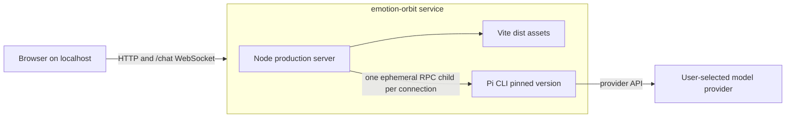

# Self-Hosted Production Design

**Status:** Approved
**Date:** 2026-08-31

## Purpose

Make Emotion Orbit reproducibly self-hostable by a technically competent user without requiring host Node.js, a host Pi installation, or help from the maintainer.

The first production release is a single-user, localhost-only application built from a repository clone with Docker Compose. Conversations and visual state remain ephemeral. The existing liquid visual, deterministic client-side emotional mutation, streamed Pi conversation, accessibility behavior, and reduced-motion behavior remain unchanged.

## Success criterion

From a clean clone, a user with Docker Compose and credentials for a Pi-supported provider can:

1. Create `.env` from the supplied example.
2. Select a provider and model and supply the provider's credentials.
3. Run `docker compose up --build`.
4. Open the loopback URL and use the complete visual and streamed chat.
5. Diagnose configuration, provider, and runtime failures through the UI and local container logs.
6. Stop, restart, and update the application without recovering state or cleaning leaked child processes.

## Product boundary

### In scope

- One `compose.yaml`.
- One service and one container containing the built frontend, Node HTTP/WebSocket server, and a pinned Pi CLI.
- Build from the cloned source repository; no container registry is required.
- Loopback-only publication.
- Provider-agnostic pass-through to any provider supported by the bundled Pi version.
- Dedicated local `.env` configuration.
- Ephemeral Pi sessions, conversations, and visual state.
- Health checks, local operational logs, graceful shutdown, security headers, CI validation, self-hosting documentation, and an MIT license.

### Out of scope

- Accounts, authentication, authorization, billing, analytics, telemetry, or remote logging.
- LAN or public-domain hosting, TLS termination, reverse-proxy support, or trusted-proxy configuration.
- Server-side or browser-side conversation persistence.
- Databases, Docker volumes, backups, or migration tooling.
- A settings UI or browser-side secret storage.
- A provider-specific SDK or a maintained compatibility matrix for every Pi provider.
- Publishing a container image or automatic updates.
- Visual redesign, new emotional presets, or changes to the conversation contract.
- GitHub Pages deployment, because a static deployment cannot provide the `/chat` WebSocket service.

## Current constraints

The browser currently uses a same-origin `/chat` WebSocket. The Node server serves production assets and creates one `pi --mode rpc` subprocess per browser connection. Each Pi process runs without tools, skills, extensions, repository context, or session persistence. This is the correct security and process boundary for the selected single-user release and should be containerized rather than replaced.

The existing Pages workflow only publishes `dist/`; it cannot host the WebSocket bridge and therefore presents an incomplete product. The production server also imports Vite eagerly even outside development, which unnecessarily requires a build-only dependency at runtime.

## Architecture



### Container build

Use a multi-stage `Dockerfile`:

1. A builder stage uses an exact Node 22 slim image, runs `npm ci`, and creates `dist/` with `npm run build`.
2. A runtime stage uses the same exact Node 22 slim version, installs locked production npm dependencies, installs an exact `@earendil-works/pi-coding-agent` version, and copies only `dist/`, production server files, package metadata, and the startup script.
3. The runtime executes as a non-root user.
4. No credentials are accepted as build arguments or copied into an image layer.

Vite must be imported dynamically only in the development branch of `server.mjs`. This permits the production image to omit build-only dependencies.

A `.dockerignore` excludes `.git`, `.worktrees`, `.env`, `node_modules`, `dist`, evidence, screenshots, spikes, and other assets not referenced by `src/`, `public/`, or the production server. Runtime assets required by Vite remain in the build context.

### Compose topology

`compose.yaml` defines exactly one service named `emotion-orbit`:

- `build: .`
- `init: true` for child-process reaping.
- `env_file: .env` so Pi-supported provider-native variables pass through without an app-maintained allowlist.
- Internal `HOST=0.0.0.0` and `PORT=5173`.
- Port publication fixed to `127.0.0.1:${EMOTION_ORBIT_PORT:-5173}:5173`.
- A bounded `on-failure` restart policy.
- A finite stop grace period longer than the server's child-process shutdown deadline.
- An HTTP health check against `/healthz`.
- No volumes, privileged mode, host networking, Docker socket, or added Linux capabilities.

The host address is literal and cannot be changed through `.env`; only the host port is configurable. LAN and internet exposure require a later design with authentication and TLS.

## Configuration contract

`.env.example` documents:

```dotenv
PI_CHAT_PROVIDER=zai
PI_CHAT_MODEL=glm-5.1
PI_CHAT_API_KEY=
EMOTION_ORBIT_PORT=5173
```

`PI_CHAT_PROVIDER` and `PI_CHAT_MODEL` are required.

There are two credential paths:

1. `PI_CHAT_API_KEY` for providers that accept a single API key. `server/pi-rpc.js` passes this value to Pi with `--api-key` only when it is non-empty.
2. Provider-native variables in `.env` for Pi providers requiring multiple values, cloud credentials, or another upstream-supported mechanism. Because Compose injects the complete dedicated `.env`, the application does not need an incomplete provider-to-variable map.

“Any provider Pi supports” means the container preserves the bundled Pi version's provider, model, and credential interfaces. It does not mean every upstream provider/model combination is continuously tested by Emotion Orbit.

`.env` remains Git-ignored and is excluded from the Docker build context. Secrets are never logged, returned by health endpoints, copied to the browser, or persisted by the application.

## Startup and readiness

A small container startup script performs structural checks before executing Node:

1. Confirm `dist/index.html` exists.
2. Confirm `PI_CHAT_PROVIDER` and `PI_CHAT_MODEL` are non-empty.
3. Confirm the pinned `pi` executable starts and report its version.
4. If provider-native credentials are used instead of `PI_CHAT_API_KEY`, run Pi's credential readiness check for the selected provider/model without printing credentials.
5. Execute the Node server under Compose's init process.

When `PI_CHAT_API_KEY` is supplied, startup validates its presence but does not spend tokens or call the provider merely to prove that the provider accepts it. Invalid, expired, quota-limited, or network-blocked credentials therefore appear through the existing provider-error path on the first prompt. This is a provider failure, not a container-readiness failure.

`GET /healthz` returns minimal JSON and HTTP 200 only after production assets and the Pi executable are structurally available. It does not call a model, reveal configuration, or spend tokens.

Startup configuration errors print one actionable message and terminate non-zero. There is no fallback provider, fallback model, embedded key, or simulated assistant response.

## Runtime data flow

1. The browser loads the current built liquid experience from the Node server.
2. Emotional language updates the visual immediately and deterministically in the client.
3. The client sends the bounded message and validated visual label/colors over the same-origin `/chat` WebSocket.
4. The server enforces origin, payload, prompt-length, one-active-prompt, and rate-limit rules.
5. The server starts one isolated Pi RPC process for the connection using the configured provider/model and credential path.
6. Pi text deltas stream to the browser through the existing message protocol.
7. Closing or losing the socket terminates the Pi child. Refresh or restart begins a clean session.

No prompt, reply, or visual history is written to disk or logs.

## Failure handling

| Failure | Required behavior |
|---|---|
| Missing image/runtime configuration | Startup exits non-zero with the missing variable or artifact named. |
| Pi executable unavailable | Startup exits non-zero before the HTTP server listens. |
| Invalid provider/model/credentials, quota, or provider network failure | Existing streamed error UI explains that the provider failed; the container remains healthy. |
| Concurrent prompt on one connection | Existing bounded busy error; no second Pi request starts. |
| Pi child crash | Client receives offline/error state; logs record connection ID plus exit code/signal without content. Reconnect creates a new child. |
| Browser disconnect | Server terminates the corresponding child. |
| Node crash | Compose performs only the configured bounded restart attempts. |
| Container stop | Server closes WebSockets and Pi children, then exits within the Compose grace period. |
| Browser refresh or container restart | Session and visual state reset by design. |

## Security and privacy

### Network and process boundary

- The only published socket is bound to host loopback.
- `TRUST_PROXY` remains disabled.
- No application authentication or TLS is introduced because remote access is explicitly unsupported.
- The runtime is non-root and receives no host mounts, extra capabilities, or Docker control socket.
- Pi remains no-session, no-tools, no-skills, no-extensions, and no-context-files.
- Existing same-origin WebSocket validation, 8 KiB WebSocket payload cap, 2,000-character prompt cap, one-active-prompt rule, and prompt rate limit remain defense-in-depth.

### HTTP headers

Production responses add and test:

- `X-Content-Type-Options: nosniff`
- A restrictive `Referrer-Policy`
- `X-Frame-Options: DENY` and CSP `frame-ancestors 'none'`
- A restrictive `Permissions-Policy`
- A same-origin Content Security Policy that permits the local same-origin WebSocket and required bundled assets, with no inline script allowance

The CSP must be browser-tested with both the default and a custom loopback port before acceptance.

### Privacy statement

The README states:

- Emotion Orbit does not persist conversations.
- Prompts and selected visual context leave the machine for the configured provider through Pi.
- Provider retention and processing follow that provider's terms.
- Refresh, disconnect, or container recreation discards the application session.
- The visualization is interpretive and does not detect, diagnose, or treat emotion or crisis.

## Observability

Logs exist for self-host diagnosis, not analytics.

Allowed log fields:

- Application readiness and loopback URL.
- Bundled Pi version.
- Selected provider and model.
- Anonymous connection identifier.
- Pi spawn, close, exit code, and signal.
- Container/server health transitions and structural errors.

Logs must not contain prompts, replies, API keys, bearer tokens, provider credential payloads, or complete Pi event payloads. There is no telemetry, analytics SDK, crash-reporting service, or remote log sink.

## Operator experience

Primary first run:

```bash
git clone <repository>
cd emotion-orbit
cp .env.example .env
# Edit provider, model, and credentials.
docker compose up --build
```

The README documents:

```bash
# Optional background mode
docker compose up --build -d

# Status and health
docker compose ps

# Logs
docker compose logs -f emotion-orbit

# Stop
docker compose down

# Update from a clean checkout
git pull --ff-only
docker compose up --build -d

# Remove obsolete containers without deleting user data
docker compose down --remove-orphans
```

Native `npm` and host `pi` commands remain available only in a contributor/development section. Docker Compose is the supported production path.

Troubleshooting covers port conflicts, missing provider/model, Pi credential-readiness failures, invalid/expired credentials, provider quota/rate errors, WebGL/browser failures, health-check failures, logs, and complete local shutdown.

## Continuous validation

Replace the Pages deployment workflow with validation-only GitHub Actions on pull requests and pushes to `main`:

1. Check out the repository.
2. Install the documented Node version.
3. Run `npm ci`.
4. Run `npm test`.
5. Run `npm run build`.
6. Validate `docker compose config` using deterministic non-secret structural values.
7. Build the Compose service.
8. Start the service with dummy structural configuration that does not call a provider.
9. Wait for Docker health.
10. Assert `/healthz`, static app delivery, required security headers, and loopback port publication.
11. Stop the stack and assert clean shutdown.

The workflow does not publish a Pages artifact or container image and does not require real provider credentials.

## Test contract

Keep existing unit tests and add behavior-focused coverage for:

- Pi argument construction with and without `PI_CHAT_API_KEY`.
- Required provider/model validation without secret disclosure.
- Provider-native credential pass-through remaining unmodified.
- `/healthz` readiness and response minimization.
- Static security headers, index caching, and immutable asset caching.
- WebSocket and Pi-child shutdown behavior.
- Compose configuration exposing only the loopback host port.
- Container structural startup and clean termination without a real provider call.

Release acceptance additionally requires a manual clean-clone run with:

- A real provider prompt and streamed reply.
- Desktop and mobile-width browser rendering.
- No console/page errors or horizontal overflow.
- Browser reconnect and container restart.
- Invalid-provider or invalid-key error behavior.
- Reduced-motion and keyboard interaction checks.

The release may claim compatibility with Pi's provider interface, but only provider/model combinations used in explicit acceptance runs may be described as tested.

## Documentation and legal artifacts

- Add an MIT `LICENSE` file.
- Rewrite the README around Docker Compose setup, privacy, supported scope, operations, updates, troubleshooting, and contributor development.
- Add `.env.example` with commented provider credential examples that contain no usable secret.
- Remove `.github/workflows/deploy-pages.yml` and replace it with validation-only CI.
- Do not add a registry workflow, release automation, contribution guide, code of conduct, database documentation, or public-hosting guide in this scope.

## Acceptance criteria

The production pass is complete only when all of the following are true:

1. `docker compose config` resolves one service and publishes only a loopback host address.
2. A clean `docker compose up --build` requires no host Node.js or Pi installation.
3. The image contains exact documented Node and Pi versions and runs non-root.
4. `.env` and credentials are absent from Git, the Docker build context, image history, logs, health responses, and browser payloads.
5. The current liquid visual and client interactions remain behaviorally unchanged.
6. A real configured prompt streams a reply through the containerized Pi bridge.
7. Prompt/provider failures remain truthful and actionable; no fallback or fake response exists.
8. Browser disconnect, server shutdown, and container stop terminate Pi children cleanly.
9. Refresh and restart persist no conversation or visual state.
10. `/healthz`, security headers, caching, CI, tests, build, Compose smoke test, and manual browser acceptance all pass.
11. GitHub Pages no longer deploys an incomplete static product.
12. A technically competent stranger can complete setup and troubleshooting from the README without maintainer assistance.

## Rejection conditions

Reject the implementation if it:

- Defines more than one Compose service or requires a host Pi daemon.
- Publishes on `0.0.0.0`, a LAN address, or a public hostname.
- Adds authentication as compensation for remote exposure instead of retaining the localhost boundary.
- Persists conversations, model output, or visual state.
- Maintains a provider credential map that can drift from Pi.
- Logs emotional content or credentials.
- Calls a provider from `/healthz` or CI.
- Keeps the chat-incomplete GitHub Pages deployment.
- Adds unrelated visual, product, account, persistence, billing, or release-platform work.
